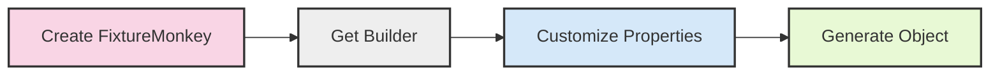

import Tabs from '@theme/Tabs';
import TabItem from '@theme/TabItem';
import CodeSnippet from '@site/src/components/CodeSnippet';
import QuickStartGuideTestJava from '@examples-java/customizing/QuickStartGuideTest.java';
import QuickStartGuideKotlinTest from '@examples-kotlin/customizing/QuickStartGuideKotlinTest.kt';


## What You'll Learn
- Core methods for customizing test objects with Fixture Monkey
- Basic approaches to customize simple and complex objects
- Solutions to the most common problems beginners face

## 5-Minute Quick Start

> This section covers only the essential information needed to get started with Fixture Monkey.

### 4 Key Methods You Must Know

If you're short on time, here's what you need to know right now. First, create a `FixtureMonkey` instance:

```java
FixtureMonkey fixtureMonkey = FixtureMonkey.create();
```

Then use these core methods:

<Tabs groupId="language">
<TabItem value="java" label="Java">

<CodeSnippet src={QuickStartGuideTestJava} language="java" method="keyMethods" />

</TabItem>
<TabItem value="kotlin" label="Kotlin">

<CodeSnippet src={QuickStartGuideKotlinTest} language="kotlin" method="keyMethods" />

</TabItem>
</Tabs>


### Visual Overview

Here's a simple flowchart showing the process of customizing objects with Fixture Monkey:



## Prerequisites
This guide assumes:
- You've already added Fixture Monkey to your project
- You know how to create a basic FixtureMonkey instance

If you haven't set up Fixture Monkey yet, refer to the [Getting Started](../get-started/requirements) section first.

## Basic Customization Methods

> This section introduces the most fundamental customization methods you'll use daily.

### Setting Property Values

The most basic way to customize an object is to set specific property values:


<Tabs groupId="language">
<TabItem value="java" label="Java">

<CodeSnippet src={QuickStartGuideTestJava} language="java" method="settingPropertyValues" />

</TabItem>
<TabItem value="kotlin" label="Kotlin">

<CodeSnippet src={QuickStartGuideKotlinTest} language="kotlin" method="settingPropertyValues" />

</TabItem>
</Tabs>


### Setting Null Values

When you need to test with null values:


<Tabs groupId="language">
<TabItem value="java" label="Java">

<CodeSnippet src={QuickStartGuideTestJava} language="java" method="settingNullValues" />

</TabItem>
<TabItem value="kotlin" label="Kotlin">

<CodeSnippet src={QuickStartGuideKotlinTest} language="kotlin" method="settingNullValues" />

</TabItem>
</Tabs>


## Working with Collections

The most important thing when working with collections is to set the size first:


<Tabs groupId="language">
<TabItem value="java" label="Java">

<CodeSnippet src={QuickStartGuideTestJava} language="java" method="workingWithCollections" />

</TabItem>
<TabItem value="kotlin" label="Kotlin">

<CodeSnippet src={QuickStartGuideKotlinTest} language="kotlin" method="workingWithCollections" />

</TabItem>
</Tabs>


For more advanced collection customization, check the [Path Expressions](../customizing-objects/path-expressions) document.

## Customizing Nested Objects

You can access nested properties using dot notation:


<Tabs groupId="language">
<TabItem value="java" label="Java">

<CodeSnippet src={QuickStartGuideTestJava} language="java" method="customizingNestedObjects" />

</TabItem>
<TabItem value="kotlin" label="Kotlin">

<CodeSnippet src={QuickStartGuideKotlinTest} language="kotlin" method="customizingNestedObjects" />

</TabItem>
</Tabs>


For more complex nested object customization, check the [InnerSpec](../customizing-objects/innerspec) guide.

## Frequently Asked Questions

> The most common issues beginners face.

### Why is my collection empty when I tried to customize an element?

:::caution[Common Mistake]
Setting a collection element without specifying the size first (e.g., `.set("products[0].name", "Laptop")` without `.size(...)`) may result in an empty collection, causing the element to be ignored.

**Always set the collection size before customizing its elements.**
:::

**Solution:**

<Tabs groupId="language">
<TabItem value="java" label="Java">

<CodeSnippet src={QuickStartGuideTestJava} language="java" method="collectionSizeFirst" />

</TabItem>
<TabItem value="kotlin" label="Kotlin">

<CodeSnippet src={QuickStartGuideKotlinTest} language="kotlin" method="collectionSizeFirst" />

</TabItem>
</Tabs>


### Why do I get null values when I didn't set them to null?

By default, Fixture Monkey may generate null values for some properties. To ensure values are not null:


<Tabs groupId="language">
<TabItem value="java" label="Java">

<CodeSnippet src={QuickStartGuideTestJava} language="java" method="ensureNotNull" />

</TabItem>
<TabItem value="kotlin" label="Kotlin">

<CodeSnippet src={QuickStartGuideKotlinTest} language="kotlin" method="ensureNotNull" />

</TabItem>
</Tabs>


## Next Steps

Now that you've learned the basics, explore these topics for more advanced usage:

1. **[Path Expressions](../customizing-objects/path-expressions)** - Accessing and customizing nested properties
2. **[Customization APIs](../customizing-objects/apis)** - Complete list of customization methods
3. **[Testing Interfaces](../customizing-objects/interface)** - How to work with interfaces
4. **[InnerSpec](../customizing-objects/innerspec)** - Advanced customization for complex objects
5. **[Arbitrary](../customizing-objects/arbitrary)** - Generating test data with specific constraints

