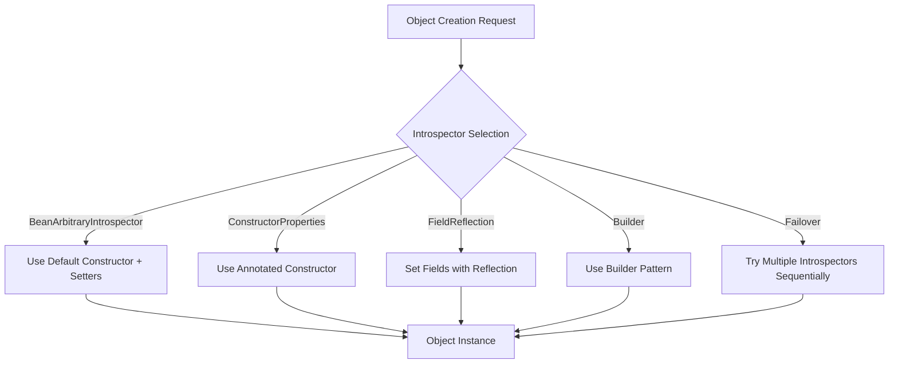

import CodeSnippet from '@site/src/components/CodeSnippet';
import IntrospectorTestJava from '@examples-java/generating/IntrospectorTest.java';

## What is an Introspector?

An `Introspector` in Fixture Monkey is simply a tool that determines how test objects are created. Think of it as a "factory" that figures out the best way to create objects for your tests.

For example, it decides:
- Whether to use a constructor or a builder to create objects
- How to set values for fields
- How to handle different types of classes in your codebase

## Quick Start: Recommended Setup for Most Projects

If you're new to Fixture Monkey and want to get started quickly, here's the setup that works for most projects:

<CodeSnippet src={IntrospectorTestJava} language="java" method="recommendedSetup" />

This setup combines multiple strategies to handle different class types, so it works well for most real-world projects without additional configuration.

## Simplest Approach (If You Just Want Basic Setup)

If you prefer the simplest possible setup, you can use the default configuration:

<CodeSnippet src={IntrospectorTestJava} language="java" method="simplestApproach" />

However, this basic approach only works well with simple JavaBean classes that have a no-arguments constructor and setter methods.

## Choosing the Right Introspector for Your Classes

Different class types require different approaches to object creation. Here's a simple guide to help you choose:

| Class Type | Recommended Introspector | Example |
|------------|--------------------------|---------|
| **Classes with setters (JavaBeans)** | `BeanArbitraryIntrospector` | Classes with getters/setters |
| **Immutable classes with constructors** | `ConstructorPropertiesArbitraryIntrospector` | Records, classes with annotated constructors |
| **Classes with mixed field access** | `FieldReflectionArbitraryIntrospector` | Classes with public fields, no-args constructor |
| **Classes using builder pattern** | `BuilderArbitraryIntrospector` | Classes with `.builder()` method |
| **Mixed codebase with different patterns** | `FailoverArbitraryIntrospector` | Projects with various class types |

## Examples for Common Class Types

:::note
The examples below use `.defaultNotNull(true)` to ensure generated properties are non-null for assertion purposes. This is optional — remove it if null values are acceptable in your tests.
:::

### Example 1: Standard JavaBean Class (with getters/setters)

<CodeSnippet src={IntrospectorTestJava} language="java" method="testCustomer" />

### Example 2: Immutable Class with Constructor

<CodeSnippet src={IntrospectorTestJava} language="java" method="testProduct" />

### Example 3: Class with Builder Pattern

<CodeSnippet src={IntrospectorTestJava} language="java" method="testUser" />

## Why Introspectors Matter

Different projects use different patterns for object creation:

- Some use simple classes with getters/setters
- Others use immutable objects with constructors
- Some follow the builder pattern
- Frameworks like Lombok generate code in specific ways

By choosing the right introspector, you can make Fixture Monkey work with your existing code without modifications, saving you time and effort.

## Frequently Asked Questions (FAQ)

### Q: I'm not sure which introspector to use. What should I do?
**A**: Start with the recommended setup (using `FailoverIntrospector` with multiple introspectors). It works for most projects and automatically tries different strategies.

<CodeSnippet src={IntrospectorTestJava} language="java" method="failoverIntrospector" />

### Q: My objects aren't being generated. What should I check?
**A**: Ensure your class has one of the following:
- A no-args constructor with setters (for `BeanArbitraryIntrospector`)
- A constructor with `@ConstructorProperties` (for `ConstructorPropertiesArbitraryIntrospector`)
- A builder method (for `BuilderArbitraryIntrospector`)

### Q: I'm using Lombok and my objects aren't generating properly. What should I do?
**A**: Add `lombok.anyConstructor.addConstructorProperties=true` to your lombok.config file and use `ConstructorPropertiesArbitraryIntrospector`.

### Q: What if I need custom creation logic for a specific class?
**A**: For specific cases, you can use the `instantiate` method to specify how an instance should be created:

```java
MySpecialClass object = fixtureMonkey.giveMeBuilder(MySpecialClass.class)
    .instantiate(() -> new MySpecialClass(specialParam1, specialParam2))
    .sample();
```

For more advanced custom logic, see the [Custom Introspector](./custom-introspector) guide, but most users won't need this.

## Available Introspectors (More Details)

### BeanArbitraryIntrospector (Default)
Best for: Standard JavaBean classes with setters

Requirements:
- Class must have a no-args constructor
- Class must have setter methods for properties

```java
FixtureMonkey fixtureMonkey = FixtureMonkey.builder()
    .objectIntrospector(BeanArbitraryIntrospector.INSTANCE) // This is the default
    .build();
```

### ConstructorPropertiesArbitraryIntrospector
Best for: Immutable objects with constructors

Requirements:
- Class must have a constructor with `@ConstructorProperties` or be a record type
- For Lombok, add `lombok.anyConstructor.addConstructorProperties=true` to lombok.config

```java
FixtureMonkey fixtureMonkey = FixtureMonkey.builder()
    .objectIntrospector(ConstructorPropertiesArbitraryIntrospector.INSTANCE)
    .build();
```

### FieldReflectionArbitraryIntrospector
Best for: Classes with field access

Requirements:
- Class must have a no-args constructor
- Fields can be accessed via reflection

```java
FixtureMonkey fixtureMonkey = FixtureMonkey.builder()
    .objectIntrospector(FieldReflectionArbitraryIntrospector.INSTANCE)
    .build();
```

### BuilderArbitraryIntrospector
Best for: Classes using the builder pattern

Requirements:
- Class must have a builder with set methods and a build method

```java
FixtureMonkey fixtureMonkey = FixtureMonkey.builder()
    .objectIntrospector(BuilderArbitraryIntrospector.INSTANCE)
    .build();
```

### FailoverArbitraryIntrospector (Recommended for Mixed Codebases)
Best for: Projects with a mix of class types

Benefits:
- Tries multiple introspectors in sequence
- Works with various class patterns
- Most versatile option

```java
FixtureMonkey fixtureMonkey = FixtureMonkey.builder()
    .objectIntrospector(new FailoverIntrospector(
        Arrays.asList(
            ConstructorPropertiesArbitraryIntrospector.INSTANCE,
            BuilderArbitraryIntrospector.INSTANCE,
            FieldReflectionArbitraryIntrospector.INSTANCE,
            BeanArbitraryIntrospector.INSTANCE
        ),
        false // Disable logging for cleaner test output
    ))
    .build();
```

If you want to disable the fail log, set the constructor argument `enableLoggingFail` to false as shown above.

:::warning
Performance note: `FailoverArbitraryIntrospector` may increase generation costs as it attempts to create objects using each registered introspector in sequence. When performance is a concern, use a specific introspector if you know your class patterns.
:::

### PriorityConstructorArbitraryIntrospector
Best for: Special cases where other introspectors don't work

Benefits:
- Uses available constructors even without `@ConstructorProperties`
- Helpful for library classes you can't modify

```java
FixtureMonkey fixtureMonkey = FixtureMonkey.builder()
    .objectIntrospector(PriorityConstructorArbitraryIntrospector.INSTANCE)
    .build();
```

## Additional Introspectors from Plugins

Plugins provide additional introspectors for specific needs:
- [`JacksonObjectArbitraryIntrospector`](../plugins/jackson-plugin/jackson-object-arbitrary-introspector) for Jackson JSON objects
- [`PrimaryConstructorArbitraryIntrospector`](../plugins/kotlin-plugin/introspectors-for-kotlin) for Kotlin classes

## How Introspectors Work (Technical Details)



## Need More Advanced Customization?

If you have special requirements for object creation that aren't covered by the built-in introspectors, you might need to create a custom introspector.

This is an advanced topic and most users won't need it. If you're interested, see the [Custom Introspector](./custom-introspector) guide.

